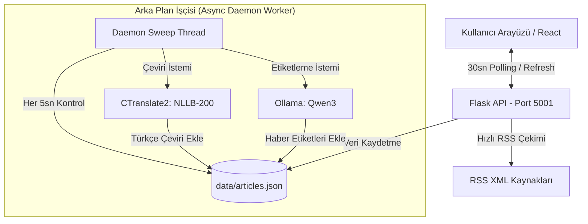

# 🌐 Global RSS Feeder (Dünya Basını Haber Takip Sistemi)

<p align="center">
  
  
  
  
  
  
</p>

---

### [English Description](#english-version) | [Türkçe Açıklama](#türkçe-versiyon)

---

## Türkçe Versiyon

**Global RSS Feeder**, dünya genelindeki önemli haber kaynaklarından (BBC, Reuters, TRT World, DW, NHK vb.) anlık olarak RSS akışlarını derleyen, haber içeriklerini **yerel yapay zeka (Ollama/LLM)** ile sınıflandırıp etiketleyen ve **CTranslate2** motoruyla yüksek hızlı yerel **NLLB-200** modeli kullanarak Türkçe'ye çeviren modern bir haber takip panelidir.

### ✨ Özellikler

*   **Anlık RSS Takibi:** Farklı ülkelerin haber kaynaklarından canlı haber akışı çekme.
*   **Yapay Zeka Tabanlı Etiketleme:** Yerel `Ollama` (`qwen3:0.6b` veya uyumlu model) aracılığıyla haber başlıklarını ve özetlerini analiz ederek dinamik konu etiketleri (Savaş, Diplomasi, Ekonomi, Yapay Zeka vb.) üretme.
*   **CTranslate2 & NLLB-200 Çeviri:** Facebook'un `nllb-200-distilled-600M` modelinin INT8 ile sıkıştırılmış versiyonu kullanılarak yüksek hızlı yerel Türkçe çeviri.
*   **Kendini İyileştiren CUDA Geçişi (Self-Healing Fallback):** Sistem çeviriyi önce GPU (Nvidia CUDA) üzerinde çalıştırmayı dener; sistemde CUDA DLL dosyaları (`cublas64_12.dll` gibi) eksikse sunucuyu çökertmeden işlemciye (CPU - INT8) yönlendirir.
*   **Disk Önbelleği (Caching):** Aynı haberlerin tekrar çekilmesini, etiketlenmesini ve çevrilmesini önlemek için benzersiz anahtarlar (URL + Başlık) ile disk üzerinde (`articles.json`) kalıcı olarak kayıt tutma.
*   **Premium Modern Arayüz:** React, Vite ve Tailwind CSS v4 ile geliştirilmiş, minimalist ve dinamik veri akışı paneli.

### ⚙️ Asenkron İşleyiş ve Veri Akışı



---

## English Version

**Global RSS Feeder** is a modern news aggregation and monitoring panel that polls RSS feeds from international news outlets (BBC, Reuters, TRT World, DW, NHK), categorizes the articles using a local **LLM (Ollama)**, and translates the titles and summaries into Turkish in real-time using a local **NLLB-200** model compiled with the high-performance **CTranslate2** engine.

### ✨ Key Features

*   **Live RSS Tracking:** Real-time fetching of world news feeds from various global networks.
*   **AI-Powered Labeling:** Uses a local `Ollama` instance (`qwen3:0.6b` or any compatible model) to run zero-shot classification on news titles and summaries, dynamically assigning topic tags.
*   **High-Speed Local Translation:** Off-line translation to Turkish using Facebook's `nllb-200-distilled-600M` model optimized with INT8 quantization via CTranslate2.
*   **Self-Healing CUDA-to-CPU Fallback:** Automatically tries running translations on Nvidia GPUs (CUDA); if the required CUDA libraries (e.g. `cublas64_12.dll`) are missing, it gracefully falls back to CPU execution without crashing the server.
*   **Persistent Caching:** Stores fetched, labeled, and translated articles on disk (`articles.json`) to prevent redundant LLM and translation inference.
*   **Premium Minimalist UI:** Built with React 19, Vite, and Tailwind CSS v4 to provide a clean and responsive user experience.

---

## 🛠️ Teknoloji Yığını / Tech Stack

### Frontend
*   **React 19 & TypeScript**
*   **Vite** (Geliştirme Sunucusu / Dev Server)
*   **Tailwind CSS v4** (Modern utility-first CSS framework)

### Backend
*   **Flask** (Python Web API)
*   **CTranslate2 & SentencePiece** (Yerel NLLB-200 Çeviri Motoru / Local Translation Engine)
*   **Ollama** (Yerel Yapay Zeka Sınıflandırma / Local LLM Inference)
*   **Feedparser / ElementTree** (RSS & Atom Parser)

---

## 🚀 Kurulum ve Başlangıç / Installation & Setup

### Sistem Gereksinimleri / Prerequisites
*   **Node.js** (v18+)
*   **Python** (3.8 - 3.11 arası / recommended)
*   **Ollama** (Yerel LLM'in arka planda çalışıyor olması gerekmektedir / Local LLM daemon must be running)

---

### 1. Backend Kurulumu (Python)

1. `backend` dizinine geçiş yapın ve gerekli paketleri yükleyin:
   ```bash
   cd backend
   pip install -r requirements.txt
   ```
   *Not: Hızlı CTranslate2 çeviri kütüphanesi için aşağıdaki kütüphanelerin yüklendiğinden emin olun:*
   ```bash
   pip install ctranslate2 sentencepiece huggingface_hub
   ```

2. **Ollama Sınıflandırma Modelini Çalıştırın:**
   Sınıflandırıcı varsayılan olarak `qwen3:0.6b` kullanır. Terminalinizde modelin yüklü ve çalışır durumda olduğundan emin olun:
   ```bash
   ollama run qwen3:0.6b
   ```
   *(Not: `llm/classifier.py` dosyasını düzenleyerek dilediğiniz başka bir modeli tanımlayabilirsiniz.)*

3. **Flask Sunucusunu Başlatın:**
   ```bash
   python app.py
   ```
   *   Sunucu varsayılan olarak **`http://localhost:5001`** adresinde çalışmaya başlar.
   *   İlk başlatmada, NLLB-200 çeviri modeli (`mijuanlo/nllb-200-distilled-600M-ct2-int8`) Hugging Face Hub üzerinden otomatik olarak indirilecektir (~600MB disk alanı).

---

### 2. Frontend Kurulumu (React)

1. Projenin kök dizininde paketleri yükleyin:
   ```bash
   npm install
   ```

2. Geliştirme sunucusunu başlatın:
   ```bash
   npm run dev
   ```
   *   Arayüze varsayılan olarak **`http://localhost:8443`** (veya Vite'in atadığı port) üzerinden erişebilirsiniz.

---

## 📂 Proje Yapısı / Directory Structure

```text
GLOBAL_RSS_FEEDER/
├── backend/
│   ├── app.py                 # Flask Sunucusu ve Arka Plan İşçisi (Worker Thread)
│   ├── data/
│   │   ├── articles.json      # Kaydedilen Canlı Haber Veritabanı
│   │   ├── feeds.json         # Kayıtlı RSS Kaynakları
│   │   └── countries.json     # Desteklenen Ülkeler Listesi
│   └── requirements.txt       # Python Bağımlılıkları
├── llm/
│   ├── classifier.py          # Ollama LLM Sınıflandırma Mantığı
│   ├── translator.py          # CTranslate2 / NLLB Çeviri Katmanı
│   └── labels.py              # Desteklenen Kategori Etiketleri
├── src/
│   ├── components/            # UI Bileşenleri (NewsCard, Tabs, Modallar)
│   ├── services/
│   │   └── api.ts             # Backend API Bağlantı Servisi
│   ├── App.tsx                # Ana Uygulama Bileşeni
│   └── main.tsx               # React Giriş Noktası
└── README.md                  # Proje Tanıtım Dosyası
```

---

## 🔌 API Uç Noktaları / API Endpoints

Flask sunucusu aşağıdaki HTTP API uç noktalarını sunmaktadır:

*   `GET /api/news` - Kaydedilmiş ve çevrilmiş haber akışını listeler.
*   `POST /api/refresh` - RSS kaynaklarını anlık olarak tarar ve veritabanını günceller.
*   `GET /api/countries` - Tanımlı ülkeleri ve bayraklarını döner.
*   `POST /api/countries` - Yeni bir ülke/bayrak ekler.
*   `GET /api/feeds` - Takip edilen RSS kaynaklarını listeler.
*   `POST /api/feeds` - Yeni bir RSS kaynağı ekler ve anlık olarak ilk verileri çeker.
*   `PUT /api/feeds/<feed_id>` - Mevcut bir RSS kaynağını günceller.
*   `DELETE /api/feeds/<feed_id>` - Kayıtlı bir RSS kaynağını siler.

---

## 📝 Lisans / License

Bu proje **MIT** lisansı ile lisanslanmıştır. Detaylar için lisans dosyasına göz atabilirsiniz.
